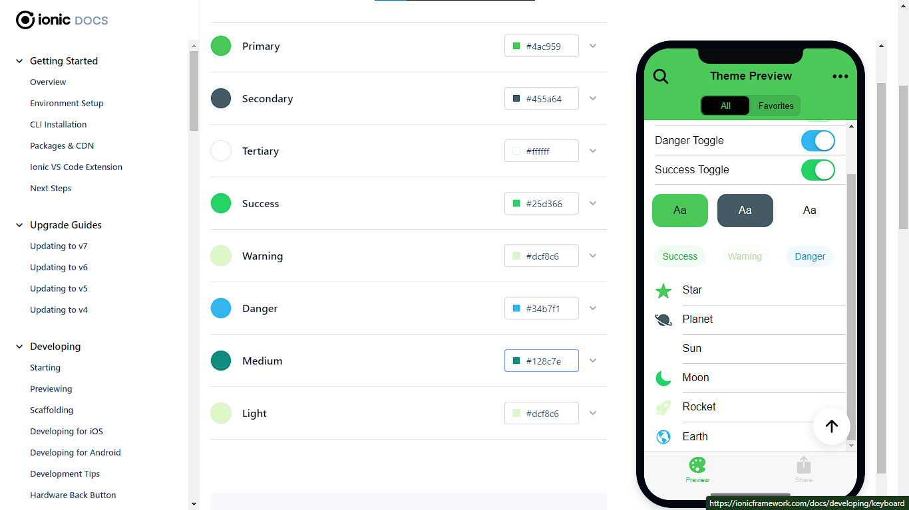
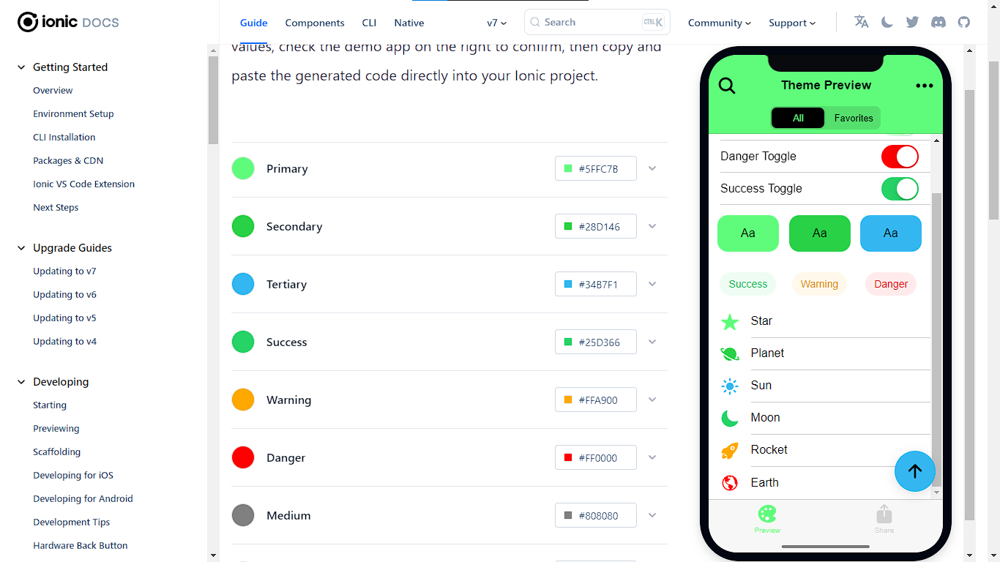

# ChatApp


  *For a seamless messaging, real-time notifications, and a user-friendly interface for effortless communication.*

---
# Features
* Direct chat functionality
* Channel chat functionality
* Sending text messages
* Typing indicator
* Load earlier messages
* Message delivery receipt
* Message read receipt
* Arbitrary message sizes
* Copy and paste text messages
* Realtime conversation view for ongoing chats
* Sign in with Email
* Full source code is available
* Supports native iOS Dark Mode
* Supported OS: Android 5.1+, Android 7+ (with google chrome, IOS 11+)

# Views
<p float="left">
  
  
  
</p>


# Overview
## 🗝️ About FireAuth
The basic purpose of any **auth** implementation is, without a doubt, to deliver a secure and seamless user experience.  
So, with the least amount of work and the most evident approach, the user can sign up, login, retrieve his password in case of loss, and so on...  
The Authentication using Firebase module, also known as **Fire-auth**, is an essential component of our very basic chat app. In this section, we will go over some of the implementation and characteristics of the authentication mechanism, code, and logic.

In our implementation we encapsulated the authentication as an "Angular" service. This is being done in order to make the overall app more modular and easy to debug. The file is: src/app/services/auth

An example of a function in the auth service (login):
```js
async login(email: string,password: string): Promise<any>{
    try{
      const response = await signInWithEmailAndPassword(this.fireAuth,email, password);
      if(response.user) this.setUserData(response.user.uid);
    }catch(e){
      throw(e);
    }
  }
```

## 📱 Initial screen

The application's **initial** screen displays the available chats, as well as the sender's name and the last message's heading, represented by an icon. A special module for components relating to this view, as well as an **Angular service**, were designed to assist this capability. These elements are intended to improve the user interface, and its work under the hood, to give a better and more intuitive experience.

## 🔥 Firebase in this app

We chose to go serverless, which meant we needed a *cloud service provider* to set up our *backend*, which is the heart of our app. To do this, we chose **Firebase**, integrating its many services and functionalities and assimilating and merging them into the app's workflow. for example the aforementioned **fireauth**, **firestore**, and the **real time database**.

## 🚥 Login and Signup Pages

For user authentication, separate *login* and *sign up* pages were created; To ensure the correctness and security of user input; these pages leverage Angular's Reactive Forms and validators; particularly for email and password fields. The *login* and *sign up* pages provide a straightforward and user-friendly interface for users to access the chat app.

## ⚙️ Angular services

There are three angular services in all.
  1. The first is to deal with the *auth*, which we called consequently **auth**- and we discussed it earlier.
  2. The second is used to store data in the *Firestore* and the *real-time database*.
  3. The third service: ApiService, a **crucial** service that should not be overlooked when analyzing the app's chat management and overall functionality, acts as a bridge between the AuthService and Firebase's Firestore database service, as well as an *encapsulator* of many of their functions. It declares functions such as setDocument and others, which are therefore used by the AuthService to efficiently interface with the database, and in the controller to establish the **chat** functionalities.

## 💂‍♂️ The AuthGuard

A guard was implemented to secure the application's routes and ensure a state-based access- the auth state of course.  
The *canLoad* method is used by the AuthGuard to validate user authentication by running the checkAuth function.  
This guard ensures that only authenticated users may access the application's protected routes, adding an extra, but essential, degree of protection.

# Chatroom Messages

The Chatroom Messages functionality, in addition to authentication, is critical in supporting real-time conversations and interactions within the app.  
Among its functions, or methods, the following ones are the most important:

## sendMessage
The sendMessage() function, implemented in the chat.page.ts file, enables users to send messages within a chatroom. This function handles the process of sending a message, including validating user input, processing the message content, and storing it in the chatroom's message history. It ensures that messages are sent smoothly and efficiently.

## getChatRoomMessages
The getChatRoomMessages() function retrieves the message history for a particular chatroom. It fetches the stored messages from the backend database and presents them in the chatroom, allowing users to view previous conversations. By utilizing Firebase's real-time updates, the function ensures that the chatroom messages are continuously synced and up to date.

## startChat
The startChat() function initiates a chat session between users. It handles the necessary actions to establish a chatroom, such as creating a new chatroom instance, setting up participants, and initializing the chatroom's properties. This function enables users to start conversations seamlessly and engage in real-time communication.

## getChat
The getChat() function retrieves the current chatroom, allowing users to access and interact with the active chat session. It provides the necessary data and context for displaying the chatroom interface, including participants' details, message history, and other relevant information. By utilizing this function, users can join existing chatrooms and resume their conversations seamlessly.
<h1>Color Palette</h1>
<div style="display: flex; justify-content: center;">
  
  
</div>


# License

MIT License
